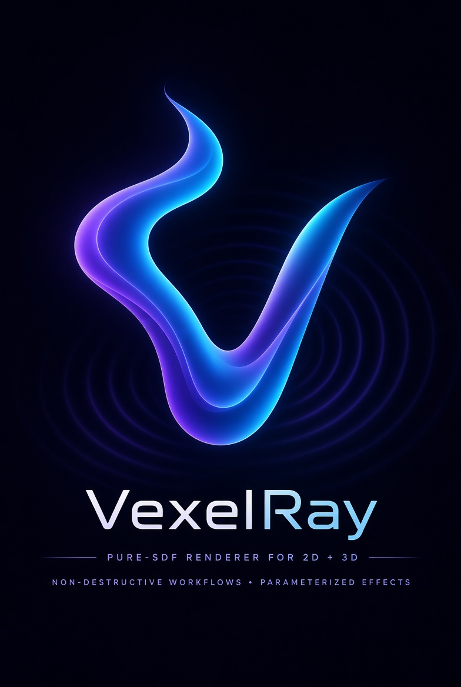

<p align="center">
  
</p>

# VexelRay

A Vulkan graphics engine whose **shaders are generated programmatically at runtime**. A hybrid polygon
rasterizer and SDF ray-marcher with a build-your-own-pipeline configuration API, flexible buffer management,
and pluggable lighting models.

- **Java 25 · Maven · GraalVM native-image · Vulkan + Panama (FFM) · JOML** — no LWJGL, no GLFW, no SDL
- Depends on the sibling **[SupirVast](../supirvast)** project for the entire shader story: engine-level
  descriptions compose into SupirVast `core` IR, which lowers to validated SPIR-V. VexelRay never emits SPIR-V
  itself — it composes *meaning*, SupirVast owns the *encoding*.

## Architecture

VexelRay **owns its Vulkan runtime** (one instance/device/swapchain shared across passes), unlike SupirVast's
monolithic single-shader hosts. That shared device is what lets a raster pass and a ray-march pass write one
coherent frame.

Multi-module Maven reactor, dependencies pointing downward:

```
vexelray                 parent (pom)
├─ vexelray-ir           terse vocabulary for authoring core IR by hand — depends on vastir alone
│    dev.vexelray.ir        Ir: constants, vectors, arithmetic, core's type discipline (broadcast, typed zero)
├─ vexelray-core         binding-agnostic engine vocabulary — no SupirVast, no Vulkan
│    dev.vexelray.runtime   VexelEngine + RuntimeManager (owns instance/device/swapchain, frame loop)
│    dev.vexelray.pipeline  build-your-own-pipeline API: Attachment, Pass (Raster/Raymarch/Compute/Post),
│                           RenderPipeline + builder, FrameGraph (dependency ordering)
│    dev.vexelray.resource  flexible buffer management: ResourceManager, GpuBuffer, BufferUsage, MemoryDomain
│    dev.vexelray.lighting  pluggable lighting models that participate in shader composition
├─ vexelray-engine-api   THE public API: the pipeline-building DSL (Target + RenderPipeline) and the
│    dev.vexelray.engine    RenderTechnique SPI + TechniqueContext/FrameContext. Core + JDK only.
├─ vexelray-shader       runtime shader generation (the SupirVast seam) — depends on vexelray-core + SupirVast
│    dev.vexelray.shader    ShaderComposer (engine concept -> core IR), ComposedShader (lowers via
│                           CoreToSpirv to a SPIR-V byte[]), ShaderKey + ShaderCache, Shading/ShadingPoint
├─ vexelray-surface      surfaces as data: a sealed Surface record tree lowered to core IR
│    dev.vexelray.surface   SurfaceCompiler -> Field (distance expr + marchability bound); Gradient
│                           differentiates the IR symbolically and Normalize rescales by it, so an arbitrary
│                           implicit expression becomes sphere-traceable. See docs/surface-compiler.md.
├─ vexelray-technique-sdf  the SDF technique: surface + lighting model -> fullscreen ray-march fragment
│    dev.vexelray.technique.sdf  SdfComposer, SdfScene, MarchSettings; ConeField is the same march with the
│                           geometry read from a storage buffer instead of compiled in — one pipeline for
│                           every scene, so new geometry is a buffer copy rather than a shader build
├─ vexelray-msdf-maven-plugin  build-time MSDF atlas generator (Maven plugin), used by vexelray-text
├─ vexelray-text         MSDF text: atlas model (msdf-atlas-gen JSON), glyph layout, MSDF shader as core IR
│    dev.vexelray.text      AtlasData/AtlasInfo, GlyphLayout, TextLayout/TextMesh, MsdfShader
├─ vexelray-canvas       2D Canvas API: immediate-mode unified-batched geometry and its uber-shader as core IR
│    dev.vexelray.canvas    Canvas, CanvasVertex, CanvasShader, Color — shapes, text and sampled images all
│                           share one fat-vertex batch, so a whole scene composites as a single draw
├─ vexelray-os           OS integration (nested aggregator) — direct Panama bindings, no LWJGL/GLFW
│    ├─ vexelray-os-api     platform-agnostic API: NativePlatform, NativeWindow, WindowConfig, Ffi helper,
│    │                      Decorations + HitRegions (application-drawn window chrome)
│    ├─ vexelray-os-windows WindowsPlatform  (user32/kernel32 + VK_KHR_win32_surface)
│    ├─ vexelray-os-linux   LinuxPlatform    (libX11 + VK_KHR_xlib_surface)      — skeleton
│    └─ vexelray-os-macos   MacosPlatform    (AppKit/QuartzCore + VK_EXT_metal_surface) — skeleton
├─ vexelray-vulkan       the Panama Vulkan runtime + resource implementation; hosts the OS-activated
│                        selection profiles that pick the platform module
│    dev.vexelray.vulkan.vk        VkLoader, VulkanInstance, VulkanDevice, Vk/Ffm binding helpers
│    dev.vexelray.vulkan.present   VulkanSwapchain, SwapchainFramebuffers, VulkanRenderPass, GraphicsPipeline,
│                           VertexBuffer, AtlasTexture, SampledImage, SampledColorTarget, OffscreenDraw,
│                           WindowedPresenter
│    dev.vexelray.vulkan.offscreen OffscreenRenderer + OffscreenReadback (headless render-to-image)
├─ vexelray-demo         Fathom — the reference demo app (first-person SDF dungeon), -Pnative single binary
└─ vexelray-experimental research harness: build/run/compare shape-definition + rendering techniques
     dev.vexelray.experimental  ComparisonHarness, Raymarcher, Metrics, SurfaceGallery, noise/blended fields
```

The `ComposedShader` `byte[]` SPIR-V boundary keeps SupirVast isolated to `vexelray-shader`; `vexelray-core`
stays free of both the shader compiler and any Vulkan binding.

### Where it's headed

**[docs/architecture.md](docs/architecture.md)** is the living target-architecture doc — the thesis (pluggable
render techniques composited into one frame), the module topology, the public pipeline-building API, and the
capability roadmap. Read it for the big picture; this README covers what exists today.

### Native integration

VexelRay talks to the OS directly through its own Panama (FFM) bindings — no LWJGL, GLFW, or SDL. Windowing and
the Vulkan surface are hand-rolled per platform, multi-platform from day one, native-image-safe, and selected at
build time by the host OS. The binding pattern is normative and documented in
**[docs/native-bindings.md](docs/native-bindings.md)** — read it before writing any native code.

## Status

**Working renderer, pre-1.0 API.** The Vulkan runtime is real end to end — instance → device → swapchain →
shaded frame — on both present paths: windowed (`WindowedPresenter`) and offscreen render-to-image with
readback. On top of it sit the surface compiler, MSDF text, and the 2D Canvas. Windows is the complete platform;
Linux and macOS are skeletons.

The pipeline-configuration API (`RenderPipeline`, `FrameGraph`, `RuntimeManager`) is still the design-stage
seam — a hybrid raster+SDF+post pipeline is expressible and validated (`HybridPipelineTest`), but the working
demos drive `vexelray-vulkan` directly rather than going through it. Wiring the runtime up behind the
`RenderTechnique` SPI is the next increment.

## See it run

The runnable demos live as test sources in `vexelray-vulkan` — each is a `main` you can launch directly:

| Demo | What it shows |
| --- | --- |
| `WindowedClearDemo` / `WindowedTriangleDemo` | swapchain present, from a clear to a shaded triangle |
| `Sdf2DWindowDemo` | the SDF-3D pipeline reused unchanged to draw 2D |
| `TextWindowDemo` | MSDF text from a build-time atlas |
| `CanvasDemo` / `DynamicCanvasDemo` | the immediate-mode 2D API, static and per-frame |
| `SampledSurfaceDemo` | a compiled surface marched into a sampled texture |
| `OffscreenTriangleSmoke` / `OffscreenScreenshotSmoke` / `SurfaceDeviceSmoke` | headless render + readback |
| `StrokeMarchSmoke` | a `Surface.Stroke` marched headlessly, answering *did anything get drawn* in numbers |

`StrokeMarchSmoke` is worth knowing about before you need it: "nothing renders" is three questions a window
cannot tell apart — a shader that draws nothing, a good shader with the camera pointed elsewhere, or a draw that
never happened. It runs the first in isolation and counts the pixels that are not sky.

`vexelray-demo` holds Fathom, the first-person SDF dungeon that exercises the render==sim thesis: the same
`core` IR is lowered to SPIR-V for the GPU and to a Truffle AST for CPU collision.

## Build

```bash
mvn install
```

Requires the sibling projects installed to the local `.m2` first: **SupirVast** (`mvn install` in
`../supirvast`) for the shader story, plus **Tactroller** and **Atchung** for the Fathom demo's input fabric.
